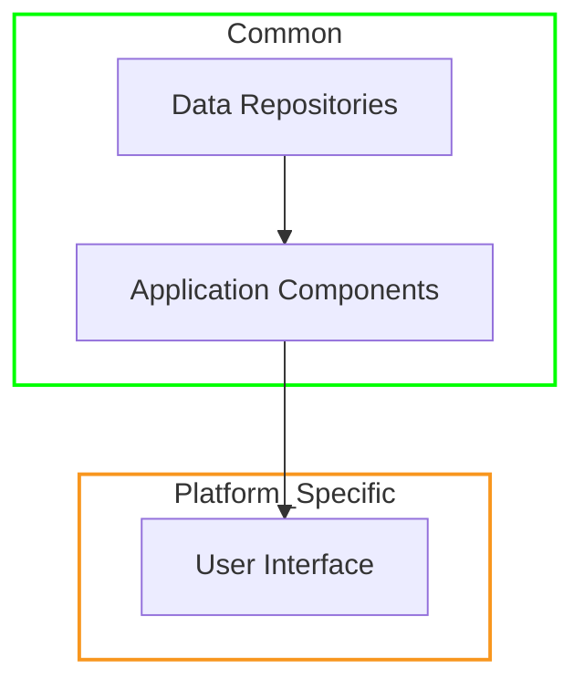
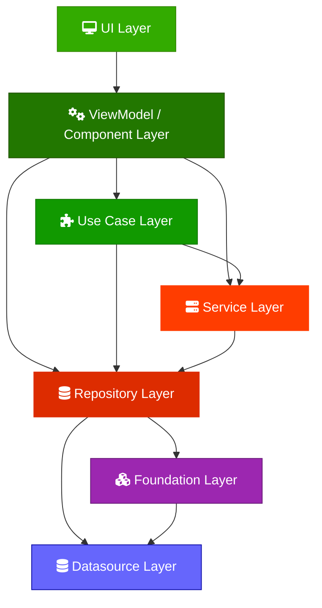
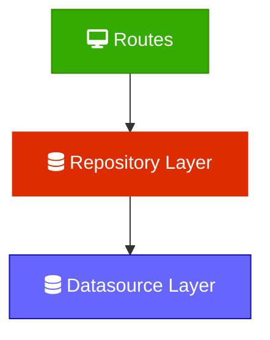

# Software Architecture

This document describes the layered architecture used in this project. **Agents working in this
codebase must follow these rules.** It is a Clean-style architecture with two orthogonal properties
tracked per component: dependency direction and statefulness.

Dependencies always point **downward** (a layer may reference only the layers below it), never
upward
and never sideways. Read the **Decision rules** section carefully — most mistakes come from adding
layers that aren't needed, or putting logic in the wrong layer.

## Client Architecture

### Multiplatform Code


The architecture broadly breaks down into two categories, `common` code that compiles and runs on
all supported platforms, and `platform specific` which much be implemented for each of the client
platforms.

The majority of code falls under `common` with only the UI layers and some glue code having to be
reimplemented per platform.

### Architecture Layers

Layers are ordered from **lowest** (closest to data) to **highest** (closest to the UI). "Lower"
means closer to data; "higher" means closer to the UI. Dependencies always point **downward** (
higher
depends on lower), never upward.

```
Data Sources  →  Foundation  →  Repositories  →  Services  →  Use Cases  →  ViewModels
  (lowest)                                                                    (highest)
```



The **mandatory spine** is just:

```
Data Source  →  Repository  →  ViewModel
```

**Services** and **Use Cases** are *optional* layers, inserted only when a specific need arises (see
Decision rules). Do not create them speculatively. **Foundation** is a small, *fixed* set of
cross-cutting stateful primitives that the whole data layer sits on (see Foundation primitives); you
depend on it, you do not add to it casually.

### Layer reference

| Layer       | State     | Lifetime / DI         | May reference                                                              | Required? |
|-------------|-----------|-----------------------|----------------------------------------------------------------------------|-----------|
| Data Source | Stateless | Factory (new per use) | Nothing in these layers                                                    | Yes       |
| Foundation  | Stateful  | Scoped singleton      | Data Sources, other Foundation primitives (acyclic)                        | Fixed set |
| Repository  | Stateful  | Scoped singleton      | Data Sources, Foundation                                                   | Yes       |
| Service     | Stateful  | Scoped singleton      | Repositories, Foundation, Data Sources                                     | No        |
| Use Case    | Stateless | Factory (new per use) | Services, Repositories, Foundation, Data Sources, other Use Cases (lazily) | No        |
| ViewModel   | —         | Per screen/owner      | Use Cases, Services, Repositories, Foundation                              | Yes       |

> **ViewModel / Component naming.** This project calls the highest layer a **Component** (Decompose
> component), which is the *ViewModel* in other architectures. The terms are used interchangeably
> here.

## Layer definitions

### Data Sources — stateless

Raw I/O and nothing else: network calls, database/DAO access, file/disk access, platform APIs (
camera, sensors, key
stores, etc.). A data source holds **no state** and contains **no business logic**. It does not
combine or call other
data sources. Factory-produced (a fresh instance per use).

### Foundation primitives — stateful, cross-cutting

A small, **fixed** set of stateful primitives the entire data layer is built on. Unlike a
Repository, a foundation
primitive is not a domain area you "get/observe/save" — it is shared infrastructure (ID allocation,
sync bookkeeping,
app settings) that nearly every repository needs. Scoped singleton, like a Repository.

Current members:

- **`IdAllocator`** — hands out the project-wide monotonic entity IDs.
- **`SyncJournal`** — records dirty entities and created/deleted IDs awaiting server reconciliation.
- **`GlobalSettingsStore`** — owns the app-global settings (and server settings).

Rules:

- **May reference:** Data Sources, and *other foundation primitives* — but the foundation set must
  stay **acyclic**. It
  is a DAG: `GlobalSettingsStore ← SyncJournal ← IdAllocator`. This is the **only** place a stateful
  component may
  reference its own tier, and it is allowed precisely because the set is kept acyclic by hand.
- **May be referenced by:** any higher layer (Repository, Service, Use Case, ViewModel) and other
  foundation primitives.
  Depending *down* into a foundation primitive is always allowed.
- **Must never reference upward.** A foundation primitive may not depend on a Repository or anything
  above it; that is
  what keeps it a leaf and the whole graph acyclic.
- **Not a default home.** Adding a class here is a deliberate, reviewed decision — not a way to
  dodge the no-sibling
  rule. If a class is really a domain area, it is a Repository; if it coordinates repositories, it
  is a Service.

> **Why this tier exists.** The no-sibling rule (below) exists for exactly one reason: to keep the
> dependency graph
> acyclic. A handful of primitives — ID allocation, sync bookkeeping, settings — are needed by
> almost every repository,
> and they are *already* acyclic leaves (nothing points back up into domain code). Forcing every
> repository to receive
> IDs and sync-marking from above would be pure churn that buys nothing the rule was meant to
> protect. So we name the
> tier honestly instead of pretending these dependencies are violations.

### Repositories — stateful

Combine one or more **data sources** for a single domain area, and own the state for that area (
caching, in-memory
flows, dedup, the source-of-truth for that domain). A repository is the default home for "
get/observe/save this kind of
data." May also depend *down* on **Foundation primitives** (e.g. `IdAllocator` for new entity IDs,
`SyncJournal` to mark
edits dirty) — but **never on another Repository**. Scoped singleton.

### Services — stateful, **optional**

The sanctioned home for **stateful coordination across multiple repositories**. Because repositories
may not reference
each other (see Dependency rules), any logic that must orchestrate two or more repositories *and*
carry state lives
here. Scoped singleton.

> Only add a Service when a single repository genuinely cannot do the job. If one repository already
> exposes what's
> needed, skip this layer entirely.

### Use Cases — stateless, **optional**

**Stateless** business logic and composition over lower layers — a single, named operation ("
RefreshFeed", "
SignInWithBiometrics"). Use cases hold no state. They may combine repositories, services, data
accessed through those,
and other use cases.

> Only add a Use Case when there is real stateless logic or composition to hold. Do **not** create a
> Use Case that
> merely forwards one call to one repository — let the consumer call the repository directly
> instead.

### ViewModels (Components)

Consume Use Cases, Services, or Repositories. **ViewModels must never reference Data Sources
directly.** Keep business
logic out of ViewModels; if logic is accumulating here, extract a Use Case.

### UI

The UI is as dumb and stateless as possible. Each platform can have its own implementation of this
layer; it consumes
ViewModels/Components and renders them.

## Dependency rules (hard constraints)

1. **Downward only.** A component may depend only on components in layers *below* it. Never
   reference a higher layer.
2. **No sibling references**, with one exception below. Components in the same layer must not depend
   on each other. This
   keeps the dependency graph acyclic by construction.
3. **Sibling exception — stateless layers only.** Use Cases (stateless) *may* reference other Use
   Cases. Repositories
   and Services (stateful) **may not** reference siblings under any circumstances.
4. **Lazy injection for sibling Use Cases.** When one Use Case depends on another, inject it
   lazily — a `Provider<T>`, a
   factory, or a `() -> T` lambda — never the constructed instance directly. Statelessness alone
   does **not** prevent a
   construction cycle; lazy resolution is what breaks it.
5. **ViewModels never touch Data Sources.** Always go through a Repository (or a Service/Use Case
   above it).
6. **Foundation primitives are a shared lower tier, not siblings.** Depending on `IdAllocator`,
   `SyncJournal`, or
   `GlobalSettingsStore` from any layer is *downward* and always allowed — they are not siblings of
   the Repositories
   that use them. They are the only stateful components that may reference their own tier, and only
   acyclically (see
   Foundation primitives). A foundation primitive must never reference a Repository or higher.

## DI conventions

- **Stateless components** (Data Sources, Use Cases) are **factory-produced**: a new instance each
  time they're
  requested.
- **Stateful components** (Repositories, Services) are **scoped singletons**. The default scope is
  the application, but
  choose a *narrower* scope when the state's natural lifetime is narrower — e.g. a user session or a
  navigation graph.
  Do not park session-scoped or user-scoped state in an app-lifetime singleton.

## Decision rules (read before adding a layer)

Start from the minimal spine and add layers only when a concrete need appears.

**Do I need a Use Case?**

- There is stateless business logic or composition that doesn't belong in a ViewModel → **yes, add a
  Use Case.**
- A repository already exposes exactly what the consumer needs → **no.** The ViewModel (or a higher
  Use Case) calls the
  repository directly. Do not add a pass-through.

**Do I need a Service?**

- I need to coordinate **two or more repositories** with shared/stateful logic → **yes, add a
  Service** (repos can't
  talk to each other, so the coordination goes here).
- A single repository can do the job → **no.**

**Do I add a Foundation primitive?**

- **Almost never.** The set is fixed (`IdAllocator`, `SyncJournal`, `GlobalSettingsStore`). Only add
  one if it is a
  genuinely cross-cutting, stateful primitive needed by *most* repositories *and* it is an acyclic
  leaf (never depends
  upward). A domain area is a Repository; cross-repo coordination is a Service. "Two repositories
  both need it" is **not**
  a reason — that is what a Service is for.

**Inserting a layer later (minimizing churn):**

- Prefer depending on **interfaces** for lower layers, so a layer can be inserted later without
  rewriting every call
  site.
- If the new layer only *wraps existing behavior behind the same surface* (caching, retry, dedup),
  implement the lower
  layer's interface (**decorator**) and swap the binding in DI — zero call-site churn.
- If the new layer exposes genuinely new orchestration methods, call sites must change. That's
  expected and is the
  honest signal you've crossed into a real coordination layer.

## Naming caveat

"Service" here is an **architectural layer**, not an Android `Service` component. When generating
code, do not confuse
the two; an architectural Service is a plain stateful class coordinating repositories, with no
relation to
`android.app.Service`.

## Worked example

A sign-in feature, fully expanded:

```
BiometricDataSource        (stateless: wraps platform biometric API)
AuthApiDataSource          (stateless: network auth calls)
TokenDataSource            (stateless: secure token storage)

AuthRepository             (stateful: combines AuthApi + Token sources, holds session state)
UserRepository             (stateful: combines a user API + local user cache)

SessionService             (stateful, OPTIONAL: coordinates AuthRepository + UserRepository
                            on login/logout — only exists because two repos must be orchestrated together)

SignInUseCase              (stateless, OPTIONAL: orchestrates the sign-in flow via SessionService)

LoginViewModel             (calls SignInUseCase)
```

A trivial read, by contrast, needs none of the optional layers:

```
SettingsRepository  →  SettingsViewModel
```

The ViewModel calls the repository directly because there is no cross-repo coordination and no
stateless logic to
extract.

## Server Architecture



### Server Routes
These are the HTTP handlers that define the various endpoints. They unmarshal data from HTTP requests, call into Repositories, and then marshal data back into HTTP responses.

### Server Repositories
These use stateful and responsible for transforming, validating, and caching data from the Datasources, and vending it to the layers above.

### Server Datasource
Stateless classes for accessing Data.
