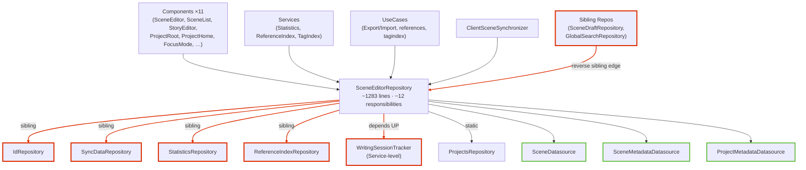
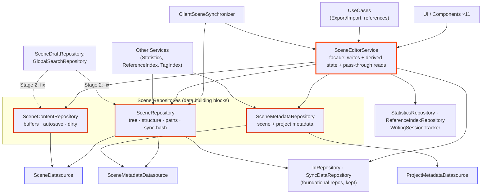

# Decomposing `SceneEditorRepository`

## Context

`SceneEditorRepository`
(`common/src/commonMain/kotlin/com/darkrockstudios/apps/hammer/common/data/sceneeditorrepository/SceneEditorRepository.kt`,
1283 lines) is the most central class in the app. It grew over years before the
Service / UseCase / Datasource layers existed, so it now bundles ~12 distinct
responsibilities and sits in the *middle* of a dependency tangle that violates
our layering rule (`docs/ARCHITECTURE.md`: a layer depends only on the layer
below; **repositories must not depend on sibling repositories**, and nothing
may depend *up*).

Today it:
- **depends sideways** on `IdRepository`, `SyncDataRepository`,
  `StatisticsRepository`, `ReferenceIndexRepository` (sibling repos), and
  **depends up** on `WritingSessionTracker` (a Service-level tracker);
- is **depended on by 26 consumers**, including two sibling repos
  (`SceneDraftRepository`, `GlobalSearchRepository`), three Services
  (`StatisticsService`, `ReferenceIndexService`, `TagIndexService`), several
  UseCases, the sync layer (`ClientSceneSynchronizer`), and ~11 Components.

**Goal of this document:** a decomposition design (responsibilities → entities →
layers) plus a *safe, phased execution + testing strategy*. **No code yet** —
this is the thinking artifact. When we execute, the agreed approach is a
**direct migration** (no temporary facade): each phase updates consumers + DI +
tests directly.

**Scope — Stage 1 only (this document).** We keep this refactor *targeted*: break
`SceneEditorRepository` up and fix the edges it *owns* (its sideways/up
dependencies). We deliberately **defer all reverse-edge fixes** (other repos that
depend on the scene editor) to a separate **Stage 2**. Breaking the monolith up
first is what *makes* those reverse edges resolvable, so Stage 1 is the enabler.

We are also **not** globally enforcing the no-sibling-repo rule in this pass. We
keep `IdRepository` and `SyncDataRepository` as a de-facto *foundational*
sub-layer that repos may depend on — exactly as `NotesRepository`,
`TimeLineRepository`, and `EncyclopediaRepository` already do. Pushing Id/Sync
down into a true lower layer is also **future work**.

During Stage 1's direct migration, the reverse-edge consumers
(`SceneDraftRepository`, `GlobalSearchRepository`, `ClientSceneSynchronizer`, …)
are simply **repointed** at whichever decomposed entity they actually need so
everything keeps compiling — the sibling-edge *violation* is left in place for
Stage 2 to resolve.

---

## Part 1 — The decomposition

### Distinct responsibilities found in the class

| # | Responsibility | Representative members |
|---|----------------|------------------------|
| A | Scene tree / structure (authoritative in-memory hierarchy) | `sceneTree`, `rootScene`, `getSceneItemFromId`, `getSceneParentFromId`, create/delete/move/reorder/rename, archive/unarchive, `reIdScene` |
| B | Path & filename computation (order/zero-padding, fs-vs-tree resolution) | `getSceneFilePath`×3, `getSceneFileName`, `resolveParentPathFromFilesystem`, `getScenePathSegments`, `getPathSegments`, `getLastOrderNumber`, `willNextSceneIncreaseMagnitude` |
| C | Content buffers & editing | `sceneBuffers`+lock, `onContentChanged`, content debounce loop, `loadSceneBuffer`(`Async`), `storeSceneBuffer`, `discardSceneBuffer`, dirty tracking, `bufferUpdateFlow`, `subscribeToBufferUpdates` |
| D | Autosave / temp buffers / lifecycle | `storeTempJobs`, `launchSaveJob`, `storeTempSceneBuffer`, `editorScope`, `contentUpdateJob`, `onScopeClose`, `clearTempScene` |
| E | Scene metadata | `loadSceneMetadata`, `storeMetadata`, `recordSceneActivity`, `metadataUpdateFlow` |
| F | Project metadata | `getMetadata`, `metadata` flow |
| G | Sync identity hashing | `markForSynchronization`×2 (`EntityHasher.hashScene`) |
| H | Cross-cutting side-effects on mutation | `statisticsRepository.markDirty`, `referenceIndexRepository.applySceneDelta`/`markSceneDeleted`, `writingSessionTracker.*`, `syncDataRepository.recordIdDeletion` |
| I | Scene-list event channel (derived view) | `sceneListChannel`, `reloadScenes`, `getSceneSummaries`, `subscribeToSceneUpdates` |
| J | Server-sync-only mechanics | `storeSceneMarkdownRaw`, `createArchivedScene`, `rationalizeTree`, `correctSceneOrders`, `forceSceneListReload` |
| K | ID allocation | `idRepository.claimNextId/findNextId` |

### Target entities

We split into **three Repositories** (data building blocks) + **one Service**
(the Component-facing API).

**Component-facing-API rule (a deliberate convention for this domain).** Although
`docs/ARCHITECTURE.md` *permits* Components→Repositories, for the scene-editing
domain we adopt the stricter rule that **Components (and the UI) talk only to
`SceneEditorService`** (plus a few purpose-built UseCases such as
export/import). The three repositories are *not* injected into Components — they
are lower-level building blocks consumed by the service, by UseCases, and by the
sync layer. This gives the UI one obvious door: a caller never has to decide
"repo or service?" The service exposes a curated surface — it *owns* writes,
orchestration, and derived state, and **delegates reads one-to-one** to the
owning repository. Delegation is not "smearing": each responsibility's logic
lives in exactly one repository behind one consistent entry point.

#### Repository layer (depends only on Datasources + the foundational `IdRepository`/`SyncDataRepository`)

**1. `SceneRepository`** — the "data repository" the user described. Owns the
in-memory `sceneTree` and all *mechanical* structure + path logic. Responsibilities
**A, B, G, J, K** and the structural-mutation mechanics of the create/delete/
move/rename/archive paths (the tree + filesystem parts only — *without* the
stats/reference/writing-session side-effects).
- Keeps `markForSynchronization` here (it is "hash my currently-persisted data
  identity" — pure data, needs only `SceneDatasource` + `SceneMetadataDatasource`
  + `SyncDataRepository`). Keeping it at the data layer is what lets *both* the
  Service and the synchronizer use it without a service→service dependency.
- Deps: `SceneDatasource`, `SceneMetadataDatasource` (hash + initial create
  metadata), `IdRepository`, `SyncDataRepository`. **Drops** `StatisticsRepository`,
  `ReferenceIndexRepository`, `WritingSessionTracker`.

**2. `SceneContentRepository`** — the buffer/editing engine. Responsibilities
**C, D**. Owns `sceneBuffers` + lock, the content debounce pipeline, temp-buffer
autosave jobs, dirty tracking, `bufferUpdateFlow`, `subscribeToBufferUpdates`,
and its own `editorScope` + `ScopeCallback` for temp cleanup on close. Exposes a
"buffer persisted" signal so the Service can hang side-effects off saves rather
than the repo reaching up.
- Deps: `SceneDatasource`.

**3. `SceneMetadataRepository`** — Responsibilities **E, F**. `loadSceneMetadata`
(default-draft-name logic), `storeMetadata` (pure persist + emit
`metadataUpdateFlow`), `recordSceneActivity` (timestamp logic), `getMetadata`
(project metadata). The reference-delta side-effect in today's `storeMetadata`
moves up to the Service.
- Deps: `SceneMetadataDatasource`, `ProjectMetadataDatasource`.

#### Service layer

**4. `SceneEditorService`** — the **single Component-facing API** for the
scene-editing domain. Three kinds of member:
- **Orchestration (writes)** — responsibility **H**. For each editor command it
  calls the mechanical repo method then applies the higher-level concepts:
  - create → `idRepository`/repo + `statistics.markDirty`
  - delete → repo + `recordIdDeletion` + `statistics` + `referenceIndex.markSceneDeleted` + `writingSession.forgetBaseline`
  - store buffer → repo + `statistics` + `writingSession.onSceneSaved` + `recordSceneActivity`
  - store metadata → `referenceIndex.applySceneDelta` around `metadataRepo.storeMetadata`
- **Derived state** — responsibility **I**: owns the **`sceneListChannel`**
  (composes tree from `SceneRepository` + dirty ids from `SceneContentRepository`
  into `SceneSummary`) and `subscribeToSceneUpdates`; subscribes to
  `SceneContentRepository`'s "persisted" signal to run save side-effects.
- **Delegated reads** — thin one-to-one pass-throughs so Components have one door:
  `getSceneItemFromId`, `getSceneTree`, `getArchivedScenes`, `loadSceneMetadata`,
  `getSceneBuffer`/`loadSceneBufferAsync`, `subscribeToBufferUpdates`,
  `metadataUpdateFlow`, `hasDirtyBuffers`, `onContentChanged`, etc. Each forwards
  to the one owning repo; **no logic is duplicated here.**
- Deps: the three new repos + `IdRepository`, `SyncDataRepository`,
  `StatisticsRepository`, `ReferenceIndexRepository`, `WritingSessionTracker`.

### Cohesion guardrail — one responsibility, one owner (path resolution worked example)

The risk to avoid is splitting a *single* responsibility across entities so a
caller could invoke the "wrong" variant. Path resolution is the canonical case.
There are two legitimately distinct, pre-existing families:
- **Tree-derived / calculated** (`getSceneFilePath(item|id)`,
  `getSceneFilePathOrNull`, `getSceneFileName`) — need the in-memory tree + order
  padding math.
- **Filesystem-authoritative** (`resolveScenePathFromFilesystem`,
  `…IncludingArchived`, `resolveParentPathFromFilesystem`) — go to disk because
  calculated padding can disagree with the actual on-disk filename.

This duality is inherent (it is *why* `resolveParentPathFromFilesystem` exists),
not introduced by the split. The guardrail is about the *public-facing API*, not
about forcing everything into a single class:
1. **No duplicated logic.** Each variant is owned by exactly one entity — never
   re-implemented in two places. In practice both families need the in-memory
   tree, so they naturally land together on `SceneRepository`; but even if a
   future split put them in different repos, that's acceptable *provided* rule 2
   holds.
2. **One coherent door.** If higher-level code needs more than one variant,
   `SceneEditorService` surfaces them together via pass-through — a caller has a
   single place to look and is never sent hunting across repos for the "right"
   one.
3. **Only surface what's actually needed up high.** Usage data shows path methods
   are called almost entirely by `ClientSceneSynchronizer` and internal mechanics
   — Components essentially never resolve paths. So most variants need not appear
   on the service facade at all; they stay on `SceneRepository` for the sync layer
   / internal use. Promote a variant onto the service only when a Component
   genuinely needs it.
4. Keep the families intention-revealing (kdoc + "calculated" vs "fromFilesystem"
   naming) so the rare caller can't pick wrong.

Apply the same guardrail to the other shared-looking responsibilities: buffer
access (one owner: `SceneContentRepository`), metadata (one owner:
`SceneMetadataRepository`), `markForSynchronization` (one owner: `SceneRepository`).

### "Is `SceneEditorService` too broad?" — recommendation

**Keep a single `SceneEditorService` for now.** As a facade its method *count* is
wide (it re-exposes the reads Components need), but its *responsibilities* are
narrow and well-separated: all state (tree, buffers) and all real logic live in
the three repositories; the service holds only (a) write orchestration, (b)
derived scene-list state, and (c) one-line read delegations. The "god object"
anti-pattern is concentrated *logic*, not a wide door — and the logic is
distributed. A wide-but-thin facade is the price of the single-API rule the UI
wants, and it is an acceptable, intentional trade.

Splitting it further now is counter-productive because the obvious second
service — a `SceneSyncService` for the server-sync operations — would have to be
called *by* `SceneEditorService` (markForSync runs before every mutation) and
*by* `ClientSceneSynchronizer`, creating service→service sibling dependencies
that our current layering forbids. We avoid that by keeping the sync *mechanics*
(G, J) down in `SceneRepository` as data operations. **Internal seams to revisit
later** (once Id/Sync are pushed down in the future strict pass): (i) autosave
lifecycle, (ii) sync-only command orchestration. Note these as TODO comments,
don't split yet.

### Reverse-edge consumers — repoint only (no fix in Stage 1)
These depend on the scene editor today and must keep compiling after the split.
Stage 1 just repoints them; the sibling-edge violation is left for Stage 2.
- `SceneDraftRepository` (`getSceneBuffer`/`loadSceneBuffer`) → repoint to
  `SceneContentRepository`.
- `GlobalSearchRepository` (reads) → repoint to `SceneRepository` /
  `SceneMetadataRepository`.
- `ClientSceneSynchronizer` → `SceneRepository` (reads) + `SceneEditorService`
  (the few mutations).

The Stage-1 win is on the edges `SceneEditorRepository` *owns*: collapsing the
*depends-up* edge (`WritingSessionTracker`) and removing the three non-foundational
sibling deps (`StatisticsRepository`, `ReferenceIndexRepository`,
`WritingSessionTracker`) from the core scene data type.

### Stage 2 (future — not this refactor)
Recorded here so the direction is captured; **do not implement now.** Once the
monolith is broken up, fix the reverse edges:
- **`GlobalSearchRepository` → `GlobalSearchService`** — it is already a Service by
  our doc (stateful, combines four repositories); a rename/reclassify makes its
  dependency on `SceneRepository` a legal Service→Repository edge.
- **Split `SceneDraftRepository`** into the data repo + a stateless
  **`SaveDraftUseCase`** (validate → claim id → resolve current content via
  `SceneContentRepository.getCurrentMarkdown` → `storeDraft`), matching the
  references-domain UseCase precedent.
- Revisit the synchronizer coupling and the broader push of `IdRepository` /
  `SyncDataRepository` into a true foundational layer.

---

## Dependency graph — before & after

### Before (today)

`SceneEditorRepository` sits in the middle of the tangle: 26 inbound consumers
(including two sibling repos via reverse edges), four sibling-repo outbound deps,
and one depends-*up* edge. Red = layering violation, green = legal.

### After (Stage 1)

Components see **one door** (`SceneEditorService`). The three repositories are
data building blocks; the service owns writes/orchestration/derived state and
passes reads through. Other Services/UseCases use the repos directly
(service→repo, legal). Reverse-edge repos are merely *repointed* (dashed = still
a violation, deferred to Stage 2).

> Note on the derived scene-list signal: `sceneListChannel` (tree + dirty-buffer
> ids) is composed in `SceneEditorService` for Components. Services that today
> subscribe to it (`ReferenceIndexService`, `SceneMetadataReferenceRemapper`) only
> need *structure-changed* notifications, so they subscribe to a tree-change
> signal on `SceneRepository` (service→repo, legal) rather than the composed
> summary — avoiding a new service→service edge.

---

## Part 2 — Safe, phased execution strategy

Direct migration (no permanent back-compat shim on the old type), so the **test
suite is the only safety net** — invest there first. Existing tests live in
`common/src/desktopTest/kotlin/repositories/sceneeditor/` and, happily, are
already split by concern in a way that maps onto the new entities. Framework:
JUnit5 + MockK + Okio `FakeFileSystem` + Koin test, via `utils/BaseTest.kt`,
`utils/TestProjectUtils.kt`, `utils/TestStrRes.kt`.

**Sequencing principle — facade first, then carve behind it.** Because
`SceneEditorService` is the permanent Component-facing API, introduce it *first*
and migrate Components to it *once*; then extract the three repositories *behind*
the stable service surface so the UI never sees the internal churn. (This is not
the rejected "keep the old repository as a back-compat shim" approach — Components
move to their permanent home; the monolith is carved up and deleted.)

**The facade is also our regression harness.** Its API is fixed from Phase A
onward, so a behavior suite written against `SceneEditorService` stays valid
through every later carving step *without edits*. That gives a fast, stable
"is behavior still correct?" loop: re-run the same facade tests after each repo
extraction — green means the carving preserved behavior.

### Phase 0 — Characterization & coverage baseline
Before touching anything, run the existing suite and record the green baseline
(`./gradlew :common:desktopTest`). Note the subtle behaviors most at risk (see
Risk Register) so the Phase-A facade suite covers them deliberately.

### Phase A — Stand up the `SceneEditorService` facade; migrate Components; lock in behavior tests
Create `SceneEditorService` that initially **delegates to the existing
`SceneEditorRepository`** (reads forwarded, writes forwarded). Register in
`mainModule.kt`. Migrate every **Component / UI** consumer to inject the service
instead of the repository (their permanent home). Repo-level consumers (sync,
other services/UseCases) stay on the old class for now.

Then **write the comprehensive behavior suite against `SceneEditorService`** —
exercise each command + observable (create/delete/move/rename/archive,
buffer load/edit/save/discard, dirty tracking, metadata read/write, the
`sceneListChannel`/`bufferUpdateFlow`/`metadataUpdateFlow` emissions, autosave
debounce, sync-hash marking) and assert end-to-end behavior, prioritising the
Risk-Register items. This suite is the durable contract: it must stay green
**unchanged** through Phases B–D. No behavior change in this phase — the existing
suite + this new facade suite both pass.

### Phase B — Extract `SceneMetadataRepository` (behind the facade)
Most self-contained; biggest read surface (`loadSceneMetadata`/`storeMetadata`).
Move E+F into the new repo; the service's metadata methods now forward to it, and
the reference-delta side-effect moves into the service's `storeMetadata`
orchestration. Repoint non-component repo-level callers. **Re-run the Phase-A
facade behavior suite unchanged — it must stay green.** Migrate
`SceneEditorRepositoryMetadataTest.kt` → `SceneMetadataRepositoryTest`.

### Phase C — Extract `SceneContentRepository` (behind the facade)
Move C+D (buffers, debounce, temp autosave, lifecycle). Introduce the
"buffer persisted" signal that the service subscribes to for save side-effects.
Riskiest phase (timing/lifecycle) — see Risk Register. **Re-run the facade
behavior suite unchanged.** Migrate `SceneEditorRepositoryBufferTest.kt` →
`SceneContentRepositoryTest`.

### Phase D — Slim the core into `SceneRepository`; finalize the service
Rename the residual monolith to `SceneRepository`; it now holds A, B, G, J, K +
mechanical mutations only, and **drops** the `StatisticsRepository` /
`ReferenceIndexRepository` / `WritingSessionTracker` constructor params (those
side-effects now live in the service's command orchestration). Repoint the
remaining repo-level consumers (`SceneDraftRepository`, `GlobalSearchRepository`,
`ClientSceneSynchronizer`) at the appropriate new repos — *repoint only*, the
reverse-edge violations are left for Stage 2. Split
`MoveTest`/`ArchiveTest`/`LoadTest`/`OtherTest`: structural assertions →
`SceneRepositoryTest`; side-effect assertions → `SceneEditorServiceTest` (mocked
`StatisticsRepository`/`ReferenceIndexRepository`/`WritingSessionTracker`/
`SyncDataRepository`). **Re-run the facade behavior suite unchanged — final green
on it is the proof the whole carve preserved behavior.**

### Phase E — Cleanup
Finalize DI wiring in `mainModule.kt`, delete any dead code, resolve
`ScopeCallback` ownership across `SceneContentRepository` / `SceneEditorService`,
and add a short "scene-editing domain API" note to `docs/DESIGN_PATTERNS.md`
documenting the Components-talk-to-`SceneEditorService`-only convention.

### Behavioral Risk Register (what is most likely to break subtly)
1. **Zero-padding / order magnitude** recalculation on create/move
   (`willNextSceneIncreaseMagnitude`, `updateSceneOrderMagnitudeOnly`,
   `updateSceneOrder`) — filename churn when sibling count crosses a digit boundary.
2. **Filesystem-vs-tree path resolution** (`resolveParentPathFromFilesystem`
   fallback) — calculated path can disagree with on-disk padding.
3. **Autosave debounce timing** (`debounceUntilQuiescentBy`, `BUFFER_COOL_DOWN`)
   and **temp-buffer flush on `onScopeClose`** — ordering of job-join vs scope
   cancel; must not lose or double-write buffers.
4. **Sync hash exactness** — `markForSynchronization` must hash byte-identical
   content/metadata as today, or sync will see spurious diffs. Pin with a
   characterization test on `EntityHasher.hashScene` inputs.
5. **`SceneSummary` composition** — tree + dirty-buffer-ids now come from two
   repos; verify `sceneListChannel` emits the same combined snapshots.
6. **Archived-scene flattening** (`getPathSegments` returns empty; path resolved
   via `...IncludingArchived`) across `reIdScene`/`markForSynchronization`.
7. **`replay`/`extraBufferCapacity` semantics** of the moved `SharedFlow`s —
   late subscribers (e.g. `subscribeToSceneUpdates` triggers an initial
   `reloadScenes`) must still get the replayed value.

### Verification
- **Primary loop:** re-run the Phase-A `SceneEditorService` behavior suite —
  *unchanged* — after every carving step. Because the facade API is fixed, its
  continued green is the fast, direct proof that behavior was preserved.
- After every phase: `./gradlew :common:desktopTest` must stay green overall.
- Full build across targets before finishing the effort.
- Manual smoke (optional, via the `run` skill): open a project, edit/create/move/
  archive a scene, confirm autosave + scene-list update + stats refresh.

### Open question to settle at execution time
`ScopeCallback` / `editorScope` ownership when both `SceneContentRepository`
(autosave) and `SceneEditorService` (orchestration loop) have lifecycles — decide
whether the service drives shutdown ordering or each registers its own callback.
