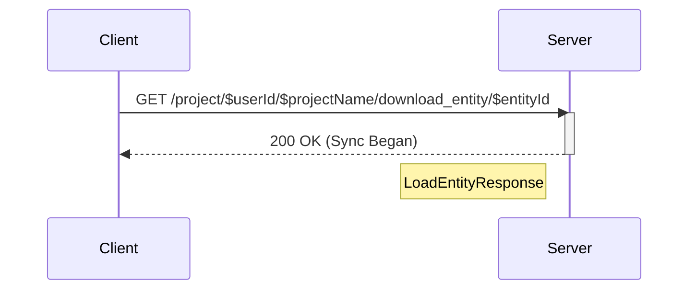
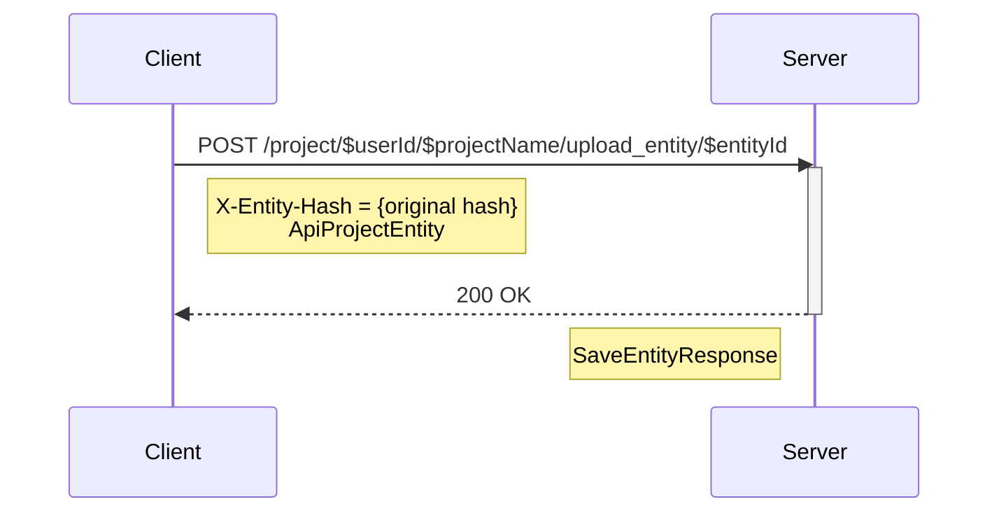
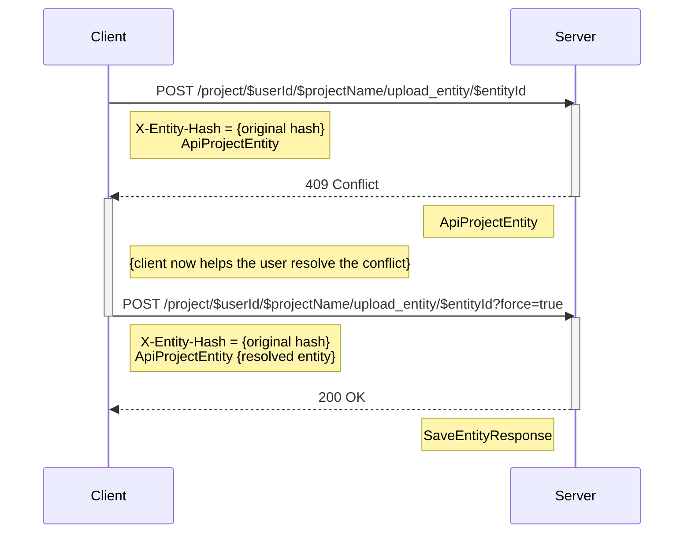
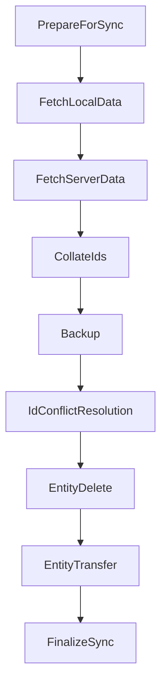

# Synchronization Protocol

This doc will try to give a breif (_as possible_) overview of the client/server synchronization
protocol Hammer
uses.

## Two levels of syncing

**Account Sync:** This synchronizes what projects the Account has, creating, deleting, or renaming
just the top level directories on the client

**Project Sync:** This synchronizes an individual project and all of it's Entities

---

## Account Sync Protocol

Before any project level syncing is done, we must first do an Account level sync.

This will handle creating, deleting, and renaming projects, to bring the client and server into
parity with each other.
Additionally, it will find or create a `projectId` for the client's local projects. These are the
key to being able to sync a local project with the server.

Any given user account may only have one sync in progress at a time. Attempting to start a sync when
one is already in progress will result in a failure to begin the sync.

```mermaid
sequenceDiagram
	participant Client as Client
	participant Server as Server

	rect rgb(1, 59, 15)
		Client ->> Server: GET /projects/{userId}/begin_sync
		activate Server
		Note right of Client: bearer token
		Server -->> Client: 200 OK (Sync Began)
		deactivate Server
		activate Client
		Note left of Server: syncId<br/>projects<br/>deletedProjects
		alt Sync already in progress
			Server -x Client: 400 Bad Request (sync ends here)
		end
	end
	rect rgb(11, 0, 74)
		loop Rename Projects
			Client ->> Server: GET /api/projects/{userId}/rename
			deactivate Client
			activate Server
			Note right of Client: bearer token <br/> syncId <br/> projectId <br/> projectName
			Server -->> Client: 200 OK (Rename successful)
			deactivate Server
			activate Client
			alt Rename fails
				Server -->> Client: 4XX Bad Request
			end
		end
	end

	rect rgb(74, 0, 9)
		loop Delete Projects
			Client ->> Server: GET /api/projects/{userId}/delete
			deactivate Client
			activate Server
			Note right of Client: bearer token <br/> syncId <br/> projectId
			Server -->> Client: 200 OK (Delete successful)
			deactivate Server
			activate Client
			alt Delete fails
				Server -->> Client: 4XX Bad Request
			end
		end
	end

	rect rgb(49, 0, 74)
		loop Create Projects
			Client ->> Server: GET /api/projects/{userId}/{projectName}/create
			deactivate Client
			activate Server
			Note right of Client: bearer token <br/> syncId <br/> projectName
			Server -->> Client: 200 OK (projectId)
			deactivate Server
			activate Client
			alt Creation fails
				Server -->> Client: 4XX Bad Request
			end
		end
	end

	rect rgb(0, 15, 6)
		Client ->> Server: GET /api/projects/{userId}/end_sync
		deactivate Client
		activate Server
		Note right of Client: bearer token <br/> syncId
		Server -x Client: 200 OK (Sync completed)
		deactivate Server
	end

```

---

## Project Sync Protocol

## Goal

The goal of this protocol is to synchronize the various `Entities` on the client to the server.

There is no file history as in a true version control system such as `git`. This is instead a simpler synchronization system, yet still smart enough to detect `conflicts`, and prevent edits on multiple devices from overwriting each other on accident.

As such, there is very little book keeping data, and none of it is actually required. When all actors are fully synchronized, they all contain the full set of data. Thus if the server were to die and lose all of its data, it wouldn't matter. Every client would contain everything necessary to
setup on a new server.

Further more, the protocol is fully fault tolerant. It may fail at any step along the way, and the state of the client and server will remain entirely valid, although not entirely synchronized.

## Network Protocol (overview)

This is largely a client driven synchronization process.

### SyncIDs
The client calls `begin_sync` to get a valid `syncID`. This `syncID` is provided to all subsequent calls, and is terminated with a call to `end_sync`.

There can be only one valid `syncID` per project at any given time. This prevents race conditions with two clients syncing the same project at the same time.

You may however have `syncID`s for multiple different projects simultaneously.

These are Project level `syncID`s. Account syncing use separate Account level `syncID`s. There may only be one valid Account level `syncID` at a time, and if there is a valid Account `syncID`, then no Project level `syncID`s are allowed to be created. The Account level sync must finish before any Project level syncs may begin.

### Entity Update Sequence
The server will inspect the provided ClientState, and then return a sequence of Entity IDs. Those and only those IDs should be synchronized by the client, and in that order.

### Remote Entity Deletion
The last step befor individual Entity synchronization can begin is having the Client notify the server of any locally deleted Entities.

```mermaid
sequenceDiagram
    participant Client
    participant Server

    Client->>Server: POST /project/$userId/$projectName/begin_sync
	activate Server
	Note right of Client: ProjectID<br/>ClientState

	Server -->> Client: 200 OK (Sync Began)
	deactivate Server
	activate Client
	Note left of Server: ProjectSynchronizationBegan

    rect rgb(74, 0, 9)
        loop Delete Entities
            Client->>Server: GET /project/$userId/$projectName/delete_entity/$id
            deactivate Client
            activate Server
            
            Server -->> Client: 200 OK
            deactivate Server
            activate Client
            Note left of Server: DeleteIdsResponse
        end
    end

    rect rgb(11, 0, 74)
        loop Transfer Entities
        Note right of Client: See breakout section for details
			Client ->> Server: [various]
			Server ->> Client: [various]
        end
    end

    Client->>Server: POST /project/$userId/$projectName/end_sync
	deactivate Client
	activate Server
	Note right of Client: ProjectID<br/>SyncId
	Server -->> Client: 200 OK (Sync Terminated)
	deactivate Server
	activate Client
```

## Network Protocol (Entity Transfer)
The Client now attempts to sync each ID provided in the server in the `Entity Update Sequence` in the order provided.

It will now either upload or download each ID depending on what it infers from the combined Client and Server state that has been transferred so far.

### Download
The client has determined that it needs to download the Server's copy of an Entity. This is either because the client is simply missing the Entity, or it has determined that the server has a newer version and it wants to overwrite the local client copy with the server copy.

### Upload
The client has determined that it needs to upload the local Client copy of an Entity. This is either because the server is missing the entity, or the client has a dirty copy that needs to be synchronized.

#### No conflict
In the nominal case, the server will accept the incoming entity, and simply overwrite the Server's own copy with it. The server knows this is safe to do so because it compares the Server copy's hash, with the provided `original hash`. If they match, the Server knows that the Client was editing the same copy which the server will now replace.

#### Conflict detected
In the case where the Sever and Client's `original hash` do no match, there is a conflict.

The server infers from this that the client was editing a different version of the Entity than what the server now has. This is probably because a different client uploaded an independent edit of the Entity.

The server will respond with it's copy of the Entity and require the Client to resolve the conflict by resubmitting the upload with `force=true` set.

Note that the resolved `ApiProjectEntity` in the `force` request does not have to be exclusively the Client's or Server's copy, it can be a merging between the two that the client helped the user create.

## Client Operations Sequence 
Beyond the network side of the Protocol, the Client is doing a bit of work to ensure data loss is not possible, and to work out what should be done with the minimal book keeping data it has.

## Terminology

**Entity**
any individual block of data. Each entity is given a unique ID. Examples include:

- Scene
- Scene Draft
- Timeline Event
- Encyclopedia Entry
- Note

**Entity ID**
Every Entity is given an Entity ID, which is a unique, monotonically incrementing
integer, with the first valid ID being 1

**Sync ID**
This is a UUID generated by the server and passed back to the client identifying a
particular syncing session to a particular client. The server will only allow one syncing session per
account at a time to prevent race conditions.

**Entity Update Sequence**
A list of Entity IDs in a particular order determined by the server.
The client will update these IDs in the provided order. The server will leave out IDs of Entities
that do not need synchronization.

**Re-ID**
The process of taking a client side Entity and issuing it a new ID, changing any
references to that ID in the process.

**Conflicts**
The same file that has been edited in different ways on different devices, must allow the user to resolve the conflict in order to bring them back into sync with each other.

**Dirty Entity** When a client edits a local Entity, the client first hashes the existing,
pre-edited content, and saves off the **Entity ID** and this pre-edit hash of the data to a "dirty
list". If the client and server are in sync at the time of this edit, then the saved hash in the
dirty list will match the hash of the server's copy of the Entity.
At syncing time this allows us to detect conflicts. If another client edits the same entity, and
syncs with the server first.
Thus our local "dirty list" hash will not match the hash of the server side copy, and we'll know we
have a conflict that needs resolving.
