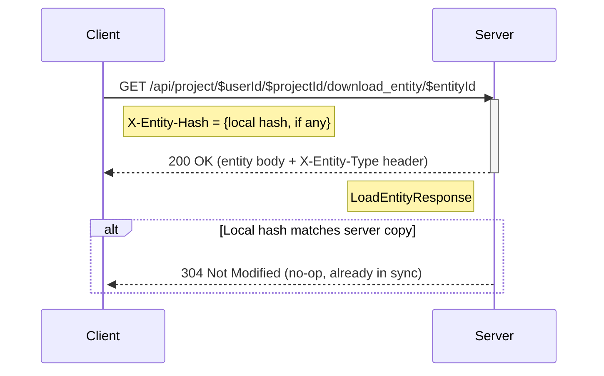
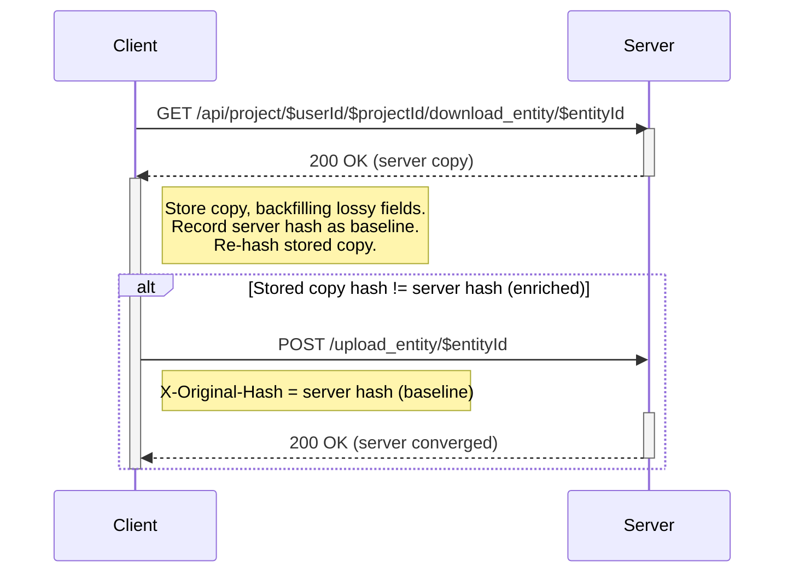
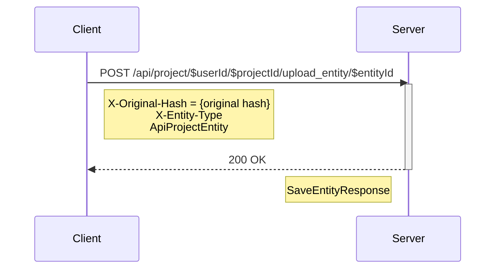
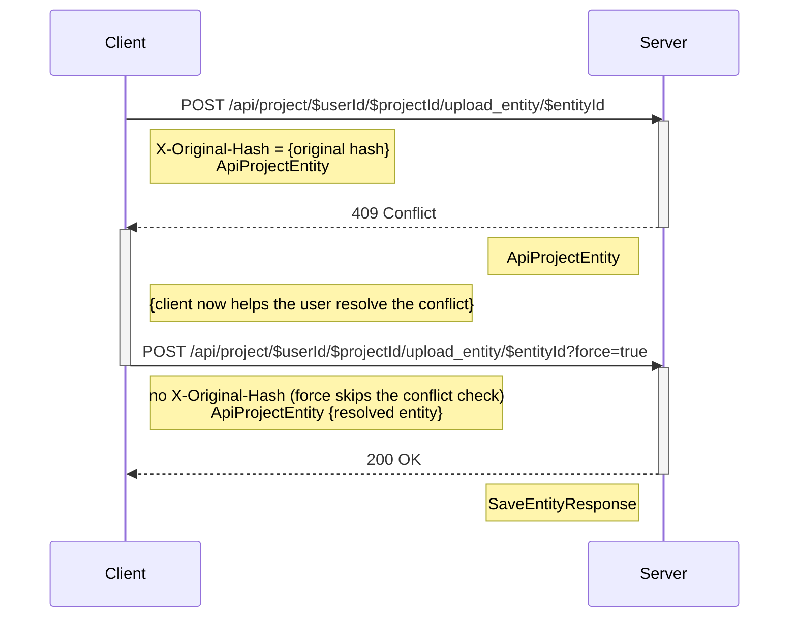
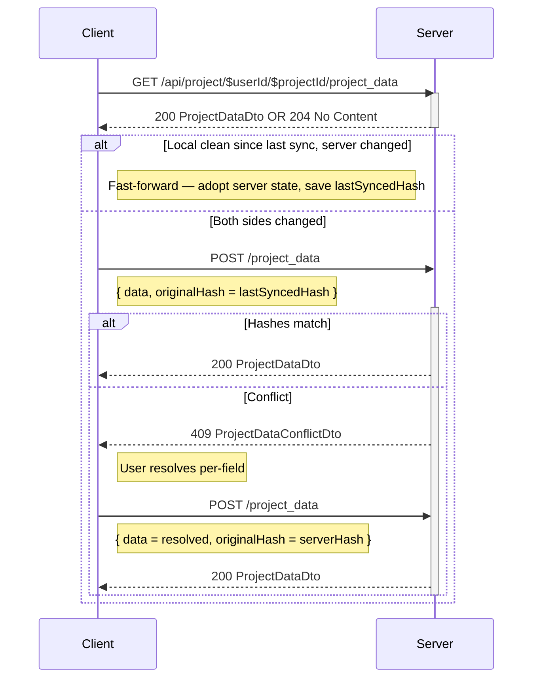
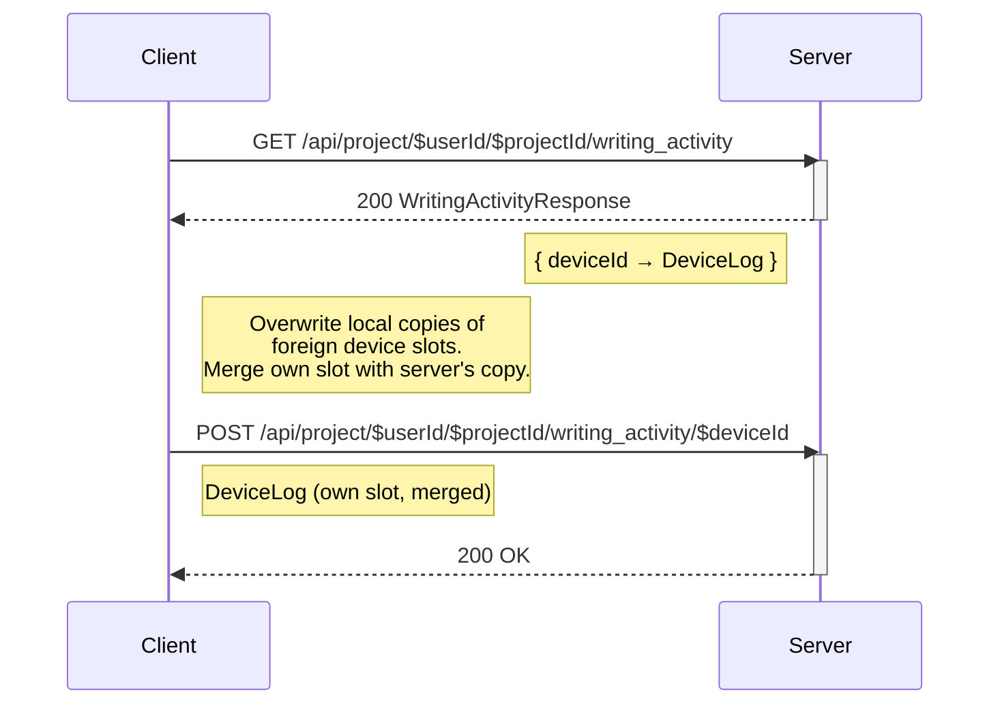
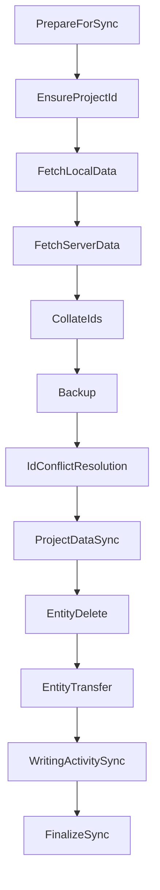

# Synchronization Protocol

This doc will try to give a brief (_as possible_) overview of the client/server synchronization
protocol Hammer
uses.

## Two levels of syncing

**Account Sync:** This synchronizes what projects the Account has, creating, deleting, or renaming
just the top level directories on the client

**Project Sync:** This synchronizes an individual project and all of its Entities

---

## Account Sync Protocol

Before any project level syncing is done, we must first do an Account level sync.

This will handle creating, deleting, and renaming projects, to bring the client and server into
parity with each other.
Additionally, it will find or create a `projectId` for the client's local projects. These are the
key to being able to sync a local project with the server.

Any given user account may only have one sync in progress at a time. Attempting to start a sync when
one is already in progress will result in a failure to begin the sync (`400 Bad Request`).

Account sessions expire after 2 minutes without activity (sliding, refreshed on each use); an
expired session may be reclaimed by anyone. Like Project sync sessions, a live account session may
also be **reclaimed by the same install** that owns it (identified server-side from the bearer
token), so a crashed account sync doesn't lock that device out until expiry. A different install
must wait for the live session to expire.

All account endpoints use `POST`. They were historically `GET`, so the server still routes the
`GET` form for legacy clients, and the client retries a `POST` that answers 404/405 as a `GET`
for servers that predate the move. Parameters are unchanged either way (query params + headers).

```mermaid
sequenceDiagram
	participant Client as Client
	participant Server as Server

	rect rgb(1, 59, 15)
		Client ->> Server: POST /api/projects/{userId}/begin_sync
		activate Server
		Note right of Client: bearer token
		Server -->> Client: 200 OK (Sync Began)
		deactivate Server
		activate Client
		Note left of Server: syncId<br/>projects<br/>deletedProjects
		alt Sync already in progress
			Server -x Client: 400 Bad Request (sync ends here)
		end
	end
	rect rgb(11, 0, 74)
		loop Rename Projects
			Client ->> Server: POST /api/projects/{userId}/rename
			deactivate Client
			activate Server
			Note right of Client: bearer token <br/> syncId <br/> projectId <br/> projectName
			Server -->> Client: 200 OK (Rename successful)
			deactivate Server
			activate Client
			alt Rename fails
				Server -->> Client: 4XX Bad Request
			end
		end
	end

	rect rgb(74, 0, 9)
		loop Delete Projects
			Client ->> Server: POST /api/projects/{userId}/delete
			deactivate Client
			activate Server
			Note right of Client: bearer token <br/> syncId <br/> projectId
			Server -->> Client: 200 OK (Delete successful)
			deactivate Server
			activate Client
			alt Delete fails
				Server -->> Client: 4XX Bad Request
			end
		end
	end

	rect rgb(49, 0, 74)
		loop Create Projects
			Client ->> Server: POST /api/projects/{userId}/create
			deactivate Client
			activate Server
			Note right of Client: bearer token <br/> syncId <br/> projectName (query param)
			Server -->> Client: 200 OK (projectId, alreadyExisted)
			deactivate Server
			activate Client
			alt Creation fails
				Server -->> Client: 4XX Bad Request
			end
		end
	end

	rect rgb(0, 15, 6)
		Client ->> Server: POST /api/projects/{userId}/end_sync
		deactivate Client
		activate Server
		Note right of Client: bearer token <br/> syncId
		Server -x Client: 200 OK (Sync completed)
		deactivate Server
	end

```



---

## Pre-Sync Change Probe

Between Account Sync and Project Sync sits an optional optimization. Account Sync brings the *set* of projects into parity; the probe then asks, in a single batched request, *which* of those projects actually have content changes — so the client can skip the per-project sync for every project that has none.

This matters because a full project sync costs ~4 round-trips (`begin_sync`, `project_data`, `writing_activity`, `end_sync`) even when nothing has changed, paid once per project on every app open. The probe collapses that to one request for the whole account.

The probe keeps no required state of its own: a client or server that ignores it loses nothing but speed.

### The Project-Wide Hash

Each project gets a single **project-wide content hash** computed over the two data sources whose divergence is unacceptable:

- all of the project's **entities** (the same per-entity hashes already produced for `ClientEntityState`), and
- the **project-data blob** (author, theme, word-count goal — hashed via `ProjectDataHasher`).

The aggregate is order-independent of enumeration: sort the entity `{id, hash}` pairs by id, fold `id:hash` pairs plus the project-data hash through the same MurmurHash3 used elsewhere. The function lives in the `base` module (alongside `EntityHasher` / `ProjectDataHasher`) so the **client and server run byte-identical code**.

**Writing activity is deliberately excluded.** It is per-device, conflict-free, and the project's authoritative record is the *union* of every device's slot — so no single device ever holds the full set, and a symmetric content hash that included it would never match across devices. It is also explicitly auxiliary (its sync phase already swallows errors and retries next time), so a skipped opportunistic activity sync is consistent with the existing tolerance. The trade-off: a change that touches *only* another device's writing activity will not be detected by the probe, and is picked up on the next sync that runs for any other reason.

### Symmetric Comparison

The probe compares **the client's current hash against the server's current hash** — not "did the server change since I last synced." A local edit makes the client's hash differ; another device's push makes the server's hash differ; only when both currently agree is the project skipped. One comparison covers both directions, and the server recomputes its hash on demand from its stored state — no per-client bookkeeping, in keeping with the protocol's "no required book keeping data" principle.

### Network Protocol

```mermaid
sequenceDiagram
    participant Client
    participant Server

    Note over Client,Server: After Account Sync, before any Project Sync

    Client->>Server: POST /api/projects/{userId}/sync_probe
    activate Server
    Note right of Client: ProjectsSyncProbeRequest<br/>[ { projectId, hash } ]
    Note over Server: For each project, recompute the<br/>project-wide hash and compare
    Server -->> Client: 200 OK
    deactivate Server
    activate Client
    Note left of Server: ProjectsSyncProbeResponse<br/>{ unchangedProjects }

    Note right of Client: Skip unchangedProjects;<br/>sync everything else as normal.
    deactivate Client
```

- `POST /api/projects/{userId}/sync_probe` — read-only, no `syncId` required.
- Request `ProjectsSyncProbeRequest { projects: List<ProjectHashItem> }`, where `ProjectHashItem { projectId, hash }`.
- Response `ProjectsSyncProbeResponse { unchangedProjects: Set<ProjectId> }`.

The server returns a project in `unchangedProjects` **only** when it is certain it is in sync — the project exists and its freshly recomputed hash matches. It omits anything it cannot certify, including any project with an **in-flight sync session** (whose stored hashes may be mid-update). A project the client never sends, or the server never returns, is simply synced the normal way.

If the endpoint is unsupported (older server) or the request fails for any reason, the client silently falls back to a full per-project sync — no behavior change.

### Correctness

The risk is asymmetric:

- A **false mismatch** — the hashes differ but nothing needed syncing — is harmless: just a redundant full sync.
- A **false match** — skipping a project that was actually divergent — loses no data: skipping is a no-op on both sides, and the next sync still reconciles through the normal dirty/conflict machinery. The only cost is that the two stay divergent longer than they should.

So the one rule the client must uphold is: **never skip a project that has un-synced local changes.** As long as a local change is recorded before a project could be reported unchanged, the probe can only ever *defer* a sync, never hide one — it adds no divergence risk beyond what the existing change tracking already guards.

How the client decides a project is eligible — and how it caches its own project-wide hash to avoid re-hashing every entity on each open — is a client implementation detail, not part of the wire protocol.

---

## Project Sync Protocol

## Goal

The goal of this protocol is to synchronize the various `Entities` on the client to the server.

There is no file history as in a true version control system such as `git`. This is instead a simpler synchronization system, yet still smart enough to detect `conflicts`, and prevent edits on multiple devices from overwriting each other on accident.

As such, there is very little book keeping data, and none of it is actually required. When all actors are fully synchronized, they all contain the full set of data. Thus if the server were to die and lose all of its data, it wouldn't matter. Every client would contain everything necessary to
setup on a new server.

Further more, the protocol is fully fault tolerant. It may fail at any step along the way, and the state of the client and server will remain entirely valid, although not entirely synchronized.

## Network Protocol (overview)

This is largely a client driven synchronization process.

### SyncIDs
The client calls `begin_sync` to get a valid `syncID`. This `syncID` is provided to all subsequent calls, and is terminated with a call to `end_sync`.

There can be only one valid `syncID` per project at any given time. This prevents race conditions with two clients syncing the same project at the same time.

#### Reclaiming a session (same install only)

A stale session would otherwise lock a user out of their own project until it expires — for example when a prior sync's `end_sync` never reached the server (the client was cancelled mid-sync, lost auth, or dropped its connection). To avoid this, `begin_sync` may **reclaim** an existing project session, but only when the request comes from the **same install** that owns it.

The install is identified server-side from the authenticated bearer token (never a client-supplied value), so it cannot be spoofed. The rules are:

- **Same install** as the active session → the old session is terminated and a fresh `syncID` is issued. The previous `syncID` immediately becomes invalid.
- **Different install**, session still active → `400 Bad Request`; the original session keeps its claim, preserving the cross-device race protection above.
- **Expired session** (any install) → treated as gone and reclaimable by anyone. Sessions expire
  after 2 minutes without activity (sliding — refreshed each time the `syncID` is used).

The client also fires `end_sync` even when its sync is cancelled, so sessions are normally released cleanly; reclaim is the safety net for the cases where that request can't be delivered.

You may however have `syncID`s for multiple different projects simultaneously.

These are Project level `syncID`s. Account syncing use separate Account level `syncID`s. There may only be one valid Account level `syncID` at a time, and if there is a valid Account `syncID`, then no Project level `syncID`s are allowed to be created. The Account level sync must finish before any Project level syncs may begin.

### Entity Update Sequence
The server will inspect the provided ClientState, and then return a sequence of Entity IDs: every server Entity the client is missing or holds a different version of (compared by hash). The client synchronizes those IDs in that order, then appends any local Entities the server doesn't know about yet (IDs above the server's `lastId`).

### Remote Entity Deletion
The last step before individual Entity synchronization can begin is having the Client notify the server of any locally deleted Entities.

```mermaid
sequenceDiagram
    participant Client
    participant Server

    Client->>Server: POST /api/project/$userId/$projectId/begin_sync
	activate Server
	Note right of Client: body: ClientEntityState (gzip)<br/>per-entity { id, hash }

	Server -->> Client: 200 OK (Sync Began)
	deactivate Server
	activate Client
	Note left of Server: ProjectSynchronizationBegan

    rect rgb(74, 0, 9)
        loop Delete Entities
            Client->>Server: GET /api/project/$userId/$projectId/delete_entity/$id
            deactivate Client
            activate Server
            
            Server -->> Client: 200 OK
            deactivate Server
            activate Client
            Note left of Server: DeleteIdsResponse
        end
    end

    rect rgb(11, 0, 74)
        loop Transfer Entities
        Note right of Client: See breakout section for details
			Client ->> Server: [various]
			Server ->> Client: [various]
        end
    end

    Client->>Server: POST /api/project/$userId/$projectId/end_sync
	deactivate Client
	activate Server
	Note right of Client: X-Sync-Id header<br/>lastSync, lastId (form params)
	Server -->> Client: 200 OK (Sync Terminated)
	deactivate Server
	activate Client
```



## Network Protocol (Entity Transfer)
The Client now attempts to sync each ID provided in the server in the `Entity Update Sequence` in the order provided.

It will now either upload or download each ID depending on what it infers from the combined Client and Server state that has been transferred so far.

### Download
The client has determined that it needs to download the Server's copy of an Entity. This is either because the client is simply missing the Entity, or it has determined that the server has a newer version and it wants to overwrite the local client copy with the server copy.

If the client has a local copy, it sends that copy's hash in the `X-Entity-Hash` header. When it matches the server's copy, the server answers `304 Not Modified` and the client records the Entity as synchronized without transferring the body.

If the server answers `404 Not Found` (an ID in the sequence with no server entity — only possible through server-side data loss or an allocation gap), the client self-heals by whichever side still holds the truth: if it has no local copy either, it records the ID as deleted so it stops appearing in future syncs; if it does hold a copy, it re-uploads it with no conflict baseline to restore the server's. Known deletions are skipped before this point, so the restore can never resurrect an intentionally deleted Entity.


#### Stale Hash Read-Repair (server-side)

The server stores a per-entity hash alongside the entity content. That hash is derived metadata —
the content is the truth. If the hash algorithm or serialized shape changes between when a row was
written and when it's next read (schema evolution, adding fields to entities), the stored hash goes
stale.

The server repairs this itself, lazily, on download: when loading an entity it compares the stored
hash against a hash freshly computed from the content, and on mismatch it rewrites the stored hash
and serves the download normally. The client never sees the repair. Because a stale hash also makes
the entity look changed to the `Entity Update Sequence` check, every stale entity is guaranteed to
be offered for download, so lazy repair converges without any O(n) sweep.

##### Legacy: 412 Stale Hash Self-Healing

Older servers (pre read-repair) instead respond to a stale hash with `412 Precondition Failed` and a
`StaleHashResponse` (`{entityId, message, cachedHash, computedHash}`), expecting the client to heal
the server by force-uploading its local copy (no `X-Original-Hash` — force skips the conflict
check). The client retains this handler for compatibility with old servers. If the client has no
local copy of the entity to upload (e.g. a fresh install), the heal is impossible and the entity is
reported as failed for that sync — against such servers the entity remains undownloadable until a
client that still has a copy syncs.

#### Post-Download Enrichment Heal (client-initiated)

The read-repair above is driven by the *server* noticing its own hash is stale. A second,
complementary heal is driven
entirely by the *client*, at the download chokepoint.

If a downloaded entity hashes differently once it's been stored, because storing it backfilled or
normalized a field the
server left null or absent, the local copy no longer matches the server's. Left alone, the server
keeps offering that
entity for download on every sync, so it re-downloads forever.

To break the loop, right after recording a successful download the client re-hashes its stored copy
against the server's
hash. If they differ, it uploads the enriched copy back, using the server's just-recorded hash as
the conflict baseline
(`original hash`). Because the sync session holds the project lock, the server's copy cannot change
between the download
and this upload, and the baseline is exactly what the server holds — so the heal always applies
cleanly, with no conflict
and no `force`.



### Upload
The client has determined that it needs to upload the local Client copy of an Entity. This is either because the server is missing the entity, or the client has a dirty copy that needs to be synchronized.

#### No conflict
In the nominal case, the server will accept the incoming entity, and simply overwrite the Server's own copy with it. The server knows this is safe to do so because it compares the Server copy's hash, with the provided `original hash`. If they match, the Server knows that the Client was editing the same copy which the server will now replace.


#### Conflict detected
In the case where the Server and Client's `original hash` do not match, there is a conflict.

The server infers from this that the client was editing a different version of the Entity than what the server now has. This is probably because a different client uploaded an independent edit of the Entity.

The server will respond with its copy of the Entity and require the Client to resolve the conflict by resubmitting the upload with `force=true` set.

Note that the resolved `ApiProjectEntity` in the `force` request does not have to be exclusively the Client's or Server's copy, it can be a merging between the two that the client helped the user create.

Uploads carry an `X-Entity-Type` header (the server rejects an upload without one, and answers `409` on a type mismatch — a distinct conflict from the hash conflict above). An upload may also fail with `413 Payload Too Large`, or `417 Expectation Failed` for a non-conflict save failure.

## Project Data Sync (non-entity blob)

In addition to entity sync, each project has a single per-project blob holding user-authored settings (author name, theme colors, word-count goal). This blob is synced as its own phase, inserted into the pipeline *before* the entity phases (entity deletion, then entity transfer) so the project's identity is settled before any entity churn.

The blob is a structured object — see `ProjectData` in the `base` module — but is treated as a single unit at the sync layer. Conflict detection is hash-based, mirroring entity sync: the client persists the `lastSyncedHash` it most recently agreed on with the server and replays it on the next upload.



Two further branches aren't diagrammed: if the server has no blob yet (`204`) and the local data is non-default, the client uploads with a null `originalHash` (the server accepts a baseline-less upload unchecked); and if the hashes already match, the phase is a no-op (re-recording `lastSyncedHash` if it was stale).

Unlike writing-activity sync (which swallows errors and continues), a non-conflict failure on the project-data phase fails the whole sync — the data is user-authored and silent loss is unacceptable.

Note: unlike the entity endpoints, the `project_data` and `writing_activity` endpoints are not gated on a `syncID` — they simply run inside the sync session window.

## Writing Activity Sync (per-device slots)

After entity transfer, the client syncs **writing activity** — an auxiliary record of writing sessions used for stats and observability (words written, session start/end, sealed flag). Each device tracks its own sessions locally; the project's full activity is the union of every device's log, keyed by `deviceId`.

The model is intentionally conflict-free by construction: **only the owning device ever writes its own slot**. When the client pulls the server's view, it wholesale-overwrites its local copies of *foreign* device slots, and merges only its *own* slot before pushing it back. There is no hash-based conflict detection like entity sync or project_data — each device is the sole writer of its slot, so there is nothing to conflict on across devices.

For the device's own slot, `mergeOwnSlotSessions` (see [SessionMerge.kt](../common/src/commonMain/kotlin/com/darkrockstudios/apps/hammer/common/data/writingactivity/SessionMerge.kt)) unions sessions by `startedAt`. On collision it keeps the higher `wordsWritten`, the later `endedAt`, and `sealed = local || remote` (sealing is one-way).



Endpoints (the project is identified by `projectId` in the path):

- `GET  /api/project/{userId}/{projectId}/writing_activity` → `WritingActivityResponse` (`Map<deviceId, DeviceLog>`)
- `POST /api/project/{userId}/{projectId}/writing_activity/{deviceId}` body: `DeviceLog`

Data shapes (`WritingSession`, `DeviceLog`, `WritingActivityResponse`) live in [WritingSession.kt](../base/src/commonMain/kotlin/com/darkrockstudios/apps/hammer/base/http/writingactivity/WritingSession.kt).

Both GET and POST failures are logged and swallowed: the writing-activity phase never fails the surrounding project sync. Activity data is auxiliary observability — a transient network or server error must not block the user's actual content from syncing. Local state is left untouched on a failed GET, so the next sync simply tries again.

## Client Operations Sequence
Beyond the network side of the Protocol, the Client is doing a bit of work to ensure data loss is not possible, and to work out what should be done with the minimal book keeping data it has.



## Terminology

**Entity**
any individual block of data. Each entity is given a unique ID. Examples include:

- Scene
- Scene Draft
- Timeline Event
- Encyclopedia Entry
- Note

**Entity ID**
Every Entity is given an Entity ID, which is a unique, monotonically incrementing
integer, with the first valid ID being 1

**Sync ID**
This is a UUID generated by the server and passed back to the client identifying a
particular syncing session to a particular client. The server allows one Account-level session per
account, and one Project-level session per project, at a time to prevent race conditions.

**Entity Update Sequence**
A list of Entity IDs in a particular order determined by the server.
The client will update these IDs in the provided order. The server will leave out IDs of Entities
that do not need synchronization.

**Re-ID**
The process of taking a client side Entity and issuing it a new ID, changing any
references to that ID in the process.

**Conflicts**
The same file that has been edited in different ways on different devices, must allow the user to resolve the conflict in order to bring them back into sync with each other.

**Dirty Entity** When a client edits a local Entity, it adds the **Entity ID** to a "dirty list"
together with that Entity's **conflict baseline** — the hash the server last confirmed for it. At
sync time the client sends this baseline as the upload's `original hash`; if another client edited
the same Entity and synced first, the server's hash no longer matches the baseline and the conflict
is detected.

The baseline is the hash recorded the last time the client and server agreed on the Entity (on a
successful upload or download), **not** a hash re-derived from the current local content at edit
time. Re-deriving it is unsafe: an Entity's hash includes fields such as `lastEdited` that the
autosave can stamp independently of a real content change, so a freshly computed baseline can
disagree with the server even when nothing meaningful changed — forging a phantom conflict. This is
the same locked-baseline scheme `project_data` uses with its `lastSyncedHash`.

A baseline exists for every Entity the client and server have agreed on, set on each successful
transfer. If a baseline is absent the server cannot conflict-check and accepts the upload, so a
project whose sync data predates this scheme backfills a baseline for every in-sync Entity on its
first sync (the local hash, which equals the server's for an agreed Entity) before any upload relies
on it.
